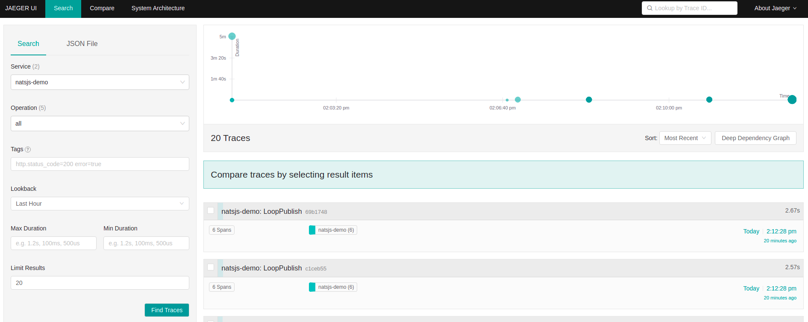

# Playing with NATS Jetstream

This project demonstrate the use of NATS Jetstream.  NATS Jetstream is the persistent storage engine built into core NATS server.

For more information about NATS Jetstream visit this [link](https://docs.nats.io/nats-concepts/jetstream)

This project will demonstrate the publishing of message from a publisher and a consumer based on different subjects. The consumer will then save the records into a simple PostgreSQL database.

## Rules

Publisher will publish the following a `UserTransaction` event.

```json

{
    "TransactionID":1,
    "UserID":1,
    "Status": "OK",
    "Amount": 456.89
}
```

The Subscriber will ingest this event and verify if the transaction is within the user threshold.

# Getting started

Clone this project

## Pre-requisites

* Kubernetes cluster (single node is enough), example MicroK8s.  

  ```shell
  sudo snap install microk8s --channel 1.23/stable --classic
  ```

* Default Persistent Volume
  
  ```shell
  microk8s enable storage`
  ```

* Install NATS using helm with Jetstream enabled.  
 
  [Nats Charts Documentation](https://docs.nats.io/running-a-nats-service/introduction/running/nats-kubernetes/helm-charts)

  [Nats Charts](https://github.com/nats-io/k8s/tree/main/helm/charts/nats)

  
  ```shell
  kubectl apply -f hack/jetstream-pvc.yaml
  helm upgrade --install --namespace nats bnats nats/nats -f hack/values.yaml
  ```

  Check out the [`values.yaml`](hack/values.yaml) in the hack directory.


## Manually create the Stream and Consumers

Refer to the [document](docs/manual_create.md)


## Build and Test

```shell
go build.
```

```shell
go test -v -p=1 -coverpkg=./... -coverprofile=coverage.txt  ./pkg/...
go tool cover -html=coverage.txt
```

## Auto create the STREAM and CONSUMERS

This project will automatically create the `STREAMS` and `CONSUMERS`, when u start the application like below.

```shell
demo-jetstream setup  --config "hack/config.yaml" \
  --streamName "USER_TXN" --streamSubjects "USER_TXN.>" \
  --consumerName "GRP_MAKER" \
  --consumerSubject "USER_TXN.maker" 
```

This will setup the STREAM `USER_TXN` and the CONSUMER `GRP_MAKER`, together with the corresponding stream and consumer subjects.


## Generate Account and authorization using nkeys

To support multi-tenant NATS, one can setup accounts as well as using the `nkeys` to secure the NATS cluster.  

**It should be noted that the [`values.yaml`](hack/values.yaml) presented above already set the necessary nkeys and users using the generated values below.**

Below are ways on how to generate the nkeys.  More information [from NATS documentation](https://docs.nats.io/running-a-nats-service/configuration/securing_nats/auth_intro/nkey_auth).


### Download the nk tools

```shell
go install github.com/nats-io/nkeys/nk
```

### Generate the keys

```shell
nk -gen user -pubout
SUAJSNDKKS4SLYV4BWYIF3RHP72PCF7LAXI6SIUIWLZW72DEBGFY6CCSAI
UB6WFVVI6BKTAHT5XGS55BONYOE3TDF47ZD7F75YVPABRXJ7XHWZKX2W
```

From the output above 

`Seed` (private key) - `SUAJSNDKKS4SLYV4BWYIF3RHP72PCF7LAXI6SIUIWLZW72DEBGFY6CCSAI`
`User` (public key) - `UB6WFVVI6BKTAHT5XGS55BONYOE3TDF47ZD7F75YVPABRXJ7XHWZKX2W`


These generated nkeys are stored in the [`seed.txt`](hack/seed.txt), this is used in the code.

```shell
nk -gen user -pubout
SUAMKIAMDUJITCXXXTL2XMHTVT3OBSA3KWLIZQ3NFBA4FMD3SQ75GJEF6Y
UD736QEIGXPHB5CLR4UAPCOEXET6WIKDYWELPIFHJJDJRNKH3SDHZTLT
```

Keep the `SUAMKIAMDUJITCXXXTL2XMHTVT3OBSA3KWLIZQ3NFBA4FMD3SQ75GJEF6Y` into [`sys-seed.txt`](hack/sys-seed.txt) and add the user key to the values.yaml

If you generate new keys, you must set them in the [values.yaml](hack/values.yaml) `auth` section.  See sample snippet below.  You must redeploy the NATS server.


```yaml
auth:
  enabled: true
  basic:
    accounts:
      demo:
        jetstream: enabled        
        users:
        - nkey: UB6WFVVI6BKTAHT5XGS55BONYOE3TDF47ZD7F75YVPABRXJ7XHWZKX2W
          permission:
            publish: 
            - "USER_TXN.maker"
            - "$JS.>"
            subscribe: 
            - "USER_TXN.maker"
            - "_INBOX.>"
        - nkey: UD736QEIGXPHB5CLR4UAPCOEXET6WIKDYWELPIFHJJDJRNKH3SDHZTLT
```

## Application configuration
In this demo, the sample application configuration is defined in [config.yaml](hack/config.yaml).

```yaml
infra:
  natsUri: "localhost:32422"
  seedPath: "hack/sys-seed.txt"
publish:
  natsUri: "localhost:32422"
  seedPath: "hack/seed.txt"
subscribe:
  natsUri: "localhost:32422"
  seedPath: "hack/seed.txt"
  sleepTimeInMillis: 3000
monitor:
  scheme: "http"
  host: "localhost"
  port: 32822
  account: "demo"
  consumerName: "GRP_MAKER"
  streamName: "USER_TXN"
  pollSeconds: 1
tracing:
  jaeger-url: http://localhost:30268/api/traces
  service-name: natsjs-demo
```

TODO: Add Jaeger configuration

## Port-forwarding

To allow the application to access NATS Jetstream,

```shell
kubectl -n nats port-forward svc/bnats 32422:4222
```

To access NATS monitoring endpoint

```shell
kubectl -n nats port-forward svc/bnats 32822:8222
```

## Publishing message to NAT Jetstream stream `USER_TXN`

This will publish 10 messages to the stream on subject `USER_TXN.maker`
```shell
./demo-jetstream publish --config "hack/config.yaml" --streamName "USER_TXN" --messageSubject "USER_TXN.maker" --maxCount "10" --message "{\"TransactionID\":1,\"UserID\":1,\"Status\":\"OK\",\"Amount\": 456.89}"
```

## Monitoring message lag on Consumer

Using the configuration [here](#application-configuration).

The monitoring will check the message lag of the Consumer `USER_TXN.maker` in the Stream `USER_TXN` using the account `demo`

```shell
./demo-jetstream monitor --config "hack/config.yaml"
...
2021-12-28T17:54:30.352+0800	INFO	monitoring/monitor.go:47	total lag is 10100
2021-12-28T17:54:31.354+0800	INFO	monitoring/monitor.go:47	total lag is 10100
2021-12-28T17:54:32.357+0800	INFO	monitoring/monitor.go:47	total lag is 10100
2021-12-28T17:54:33.360+0800	INFO	monitoring/monitor.go:47	total lag is 10100
2021-12-28T17:54:34.365+0800	INFO	monitoring/monitor.go:47	total lag is 10100
2021-12-28T17:54:35.368+0800	INFO	monitoring/monitor.go:47	total lag is 10100
2021-12-28T17:54:36.371+0800	INFO	monitoring/monitor.go:47	total lag is 10100
...
```

## Consume message

```shell

./demo-jetstream consume --config "hack/config.yaml" --consumerName "GRP_MAKER" --subscriberSubject "USER_TXN.maker"
```


## Verifier Service

Generate the protos. from project root

```
protoc --go_out=. --go_opt=paths=source_relative \
    --go-grpc_out=. --go-grpc_opt=paths=source_relative \
    pkg/api/verifier/verifier.proto
```

This service is called by the consumer when it received a message in NATS Jetstream.  

The configuration is in [`config.yaml`](hack/config.yaml)

```yaml
api:
  host: "localhost"
  port: 50055
```

## Enabling distributed tracing

Using MicroK8s, enable Jaeger

```shell
kubectl create ns observability
microk8s enable jaeger:observability
```
##  Accessing Jaeger

### To enable Jaeger collector

```shell
kubectl -n observability port-forward svc/simplest-collector 30268:14268
```

### To access Jaeger UI

```shell
kubectl -n observability port-forward svc/simplest-query 30686:16686
```

Sample trace




## Create Postgres DB

TODO


